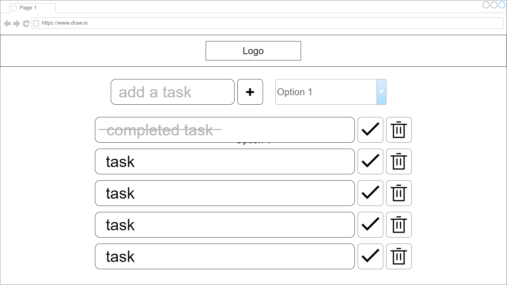
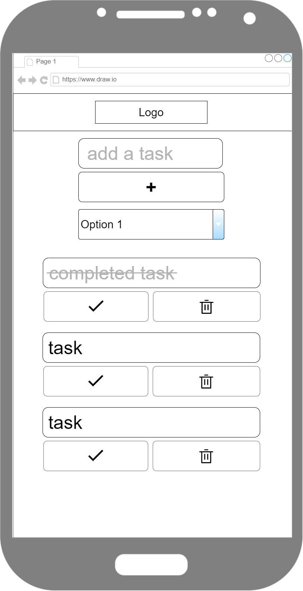

# taskit by Grace Mills

## Hosting Link

## Description and Usage
The purpose of this project is to showcase my ability to build an app using React by creating a task tracking app. The app offers task tracking functionality with a filtering functionality, so users can see their by the categories "all", "completed", and "uncompleted". However, the app does not offer local storage, meaning the tasks are erased on refresh. 

## Technologies Used
- HTML
- CSS 
- React

## User Stories
As a student I want to track my tasks for school so that I can keep up with my projects and homework.
As a language learner I want to keep track of my daily language-related tasks so that I can measure my progress in my language learning journey.
As an attorney I want to track my different work tasks so that I can distinguish billable hours from non-billable hours.

## Future Improvements
Future improvements I want to implement include adding local storage so that the tasks are saved even when the page is reloaded, adding a categorization or tagging functionality so that users can sort their task into categories like "work", "school", "home", etc, and adding a timer so that users can time their working hours and take breaks when needed.

## Wireframes

